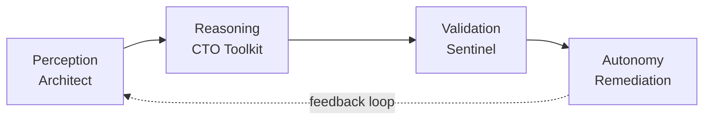

# 🔍 Análise Profunda — Projeto Nexus

**Autonomous Engineering Intelligence Platform**
*Girardelli Tecnologia*

---

## 📊 Visão Geral Executiva

| Métrica | Valor |
|---|---|
| **Pacotes** | 10 (`@nexus/*`) |
| **Arquivos de código** | ~130 |
| **Linhas de código** | ~7.500+ |
| **Testes** | 909 (mencionados no README) |
| **Tech Stack** | TypeScript 5+, Node.js 18+, ESM, Jest, React 18, Express, Prisma |
| **Licença** | BSL 1.1 (converte para Apache 2.0 em 4 anos) |

**Veredicto geral: O Nexus é um projeto ambicioso e bem arquitetado que demonstra maturidade técnica significativa.** A visão de unificar percepção, raciocínio e validação em um pipeline autônomo é diferenciada no mercado. A execução técnica é consistente e o código tem qualidade profissional.

---

## 🏗️ Análise de Arquitetura

### Pipeline Principal



> [!TIP]
> A arquitetura em camadas com feedback loop é o grande diferencial. Nenhuma ferramenta concorrente (SonarQube, CodeClimate, Snyk) faz esse loop fechado.

### Estrutura do Monorepo

| Pacote | Responsabilidade | Qualidade |
|---|---|---|
| `@nexus/types` | Tipagem compartilhada (483 linhas) | ⭐⭐⭐⭐⭐ |
| `@nexus/events` | EventBus com correlation tracking | ⭐⭐⭐⭐⭐ |
| `@nexus/core` | Orchestrator, ProviderMesh, ModelRouter, Tribunal | ⭐⭐⭐⭐⭐ |
| `@nexus/bridge` | Pipeline, Adapters, DarkFactory, IntentRouter | ⭐⭐⭐⭐ |
| `@nexus/autonomy` | RemediationEngine, DebtPrevention, AEP | ⭐⭐⭐⭐ |
| `@nexus/cloud` | Express API com DI (composition root) | ⭐⭐⭐⭐ |
| `@nexus/dashboard` | React 18 + Tailwind, 20+ componentes | ⭐⭐⭐⭐ |
| `@nexus/mcp` | 3 MCP Servers (Perception, Reasoning, Validation) | ⭐⭐⭐⭐ |
| `@nexus/cli` | CLI com ANSI output, 4 comandos | ⭐⭐⭐⭐ |
| `@nexus/app` | GitHub App (webhook handlers) | ⭐⭐⭐ |

---

## ✅ Pontos Fortes

### 1. Tipagem de Primeira Classe
O `@nexus/types` é excepcional — 483 linhas de interfaces fortemente tipadas cobrindo todas as 4 camadas. Destaque para os tipos [TemporalData](file:///Users/camilooscargirardellibaptista/Documentos/camilo/girardelli_tecnologia/repository/nexus/packages/types/src/index.ts#129-138) e [ForecastData](file:///Users/camilooscargirardellibaptista/Documentos/camilo/girardelli_tecnologia/repository/nexus/packages/types/src/index.ts#160-168) que já preparam a plataforma para análise preditiva (v4.0). O `DEFAULT_CONFIG` exportado como constante tipada é uma decisão acertada.

### 2. Padrões de Engenharia Avançados

- **Kahn's Algorithm** no [AgentOrchestrator](file:///Users/camilooscargirardellibaptista/Documentos/camilo/girardelli_tecnologia/repository/nexus/packages/core/src/orchestrator.ts#64-332) para topological sort de tasks com detecção de ciclos
- **ProviderMesh** com despacho parallel/sequential/fan-out/round-robin + consensus building + cost tracking granular
- **Tribunal Pattern** — 3 agentes independentes com mediação ponderada e detecção de disputas
- **DarkFactory** — pipeline autônomo de 7 fases (spec→deploy) com holdout testing e retry loop
- **RemediationEngine** — ciclo plan→apply→verify com sub-agent verification e rollback automático

### 3. Desacoplamento e DI
- `@nexus/cloud` usa **composition root** pattern — todos os services dependem de interfaces (`UserRepository`, `ProjectRepository`), não de implementações
- `@nexus/bridge` define [PipelineLogger](file:///Users/camilooscargirardellibaptista/Documentos/camilo/girardelli_tecnologia/repository/nexus/packages/bridge/src/nexus-pipeline.ts#36-42) local para evitar acoplamento bridge→core
- MCP servers usam [PerceptionBackend](file:///Users/camilooscargirardellibaptista/Documentos/camilo/girardelli_tecnologia/repository/nexus/packages/mcp/src/perception-server.ts#30-36) interface para desacoplar do Architect real
- [RemediationEngine](file:///Users/camilooscargirardellibaptista/Documentos/camilo/girardelli_tecnologia/repository/nexus/packages/autonomy/src/remediation.ts#146-411) depende de 4 interfaces plugáveis: [FileSystemAdapter](file:///Users/camilooscargirardellibaptista/Documentos/camilo/girardelli_tecnologia/repository/nexus/packages/autonomy/src/remediation.ts#107-113), [ValidatorAdapter](file:///Users/camilooscargirardellibaptista/Documentos/camilo/girardelli_tecnologia/repository/nexus/packages/autonomy/src/remediation.ts#115-119), [FixGenerator](file:///Users/camilooscargirardellibaptista/Documentos/camilo/girardelli_tecnologia/repository/nexus/packages/autonomy/src/remediation.ts#121-124), [SubAgentVerifier](file:///Users/camilooscargirardellibaptista/Documentos/camilo/girardelli_tecnologia/repository/nexus/packages/autonomy/src/remediation.ts#126-129)

### 4. Event-Driven Architecture
O [NexusEventBus](file:///Users/camilooscargirardellibaptista/Documentos/camilo/girardelli_tecnologia/repository/nexus/packages/events/src/index.ts#39-201) com correlation tracking (`correlationId`) permite rastrear o pipeline inteiro. Suporta wildcards, filtros, once-subscriptions, e tem event log com tamanho máximo configurável (10.000).

### 5. Multi-Model Intelligence
O [ModelRouter](file:///Users/camilooscargirardellibaptista/Documentos/camilo/girardelli_tecnologia/repository/nexus/packages/core/src/model-router.ts#187-355) com regras de roteamento baseadas em complexidade/severidade é sofisticado. A função [inferTaskProfile()](file:///Users/camilooscargirardellibaptista/Documentos/camilo/girardelli_tecnologia/repository/nexus/packages/core/src/model-router.ts#360-447) faz NLP simplificado para classificar skills automaticamente. O cost tracking por provider/phase/role no [ProviderMesh](file:///Users/camilooscargirardellibaptista/Documentos/camilo/girardelli_tecnologia/repository/nexus/packages/core/src/provider-mesh.ts#127-533) é pronto para FinOps.

### 6. CLI Profissional
469 linhas com ANSI output colorido, barras de progresso, trending com delta vs. último run, history com até 100 entradas, e persistência local em `.nexus/`. Zero dependências externas para formatação.

---

## ⚠️ Áreas de Melhoria

### 1. Bug Sutil no Logger do Pipeline

```typescript
// nexus-pipeline.ts, linha 44
class DefaultPipelineLogger implements PipelineLogger {
  info(message: string, ...args: unknown[]): void { this.logger.info(message, ...args); }
  //                                                  ^^^^^^^^^^^ NÃO EXISTE!
```
> [!CAUTION]
> `DefaultPipelineLogger.info()` referencia `this.logger` mas a classe não tem essa property. Vai lançar `TypeError` em runtime. Os outros métodos ([warn](file:///Users/camilooscargirardellibaptista/Documentos/camilo/girardelli_tecnologia/repository/nexus/packages/bridge/src/nexus-pipeline.ts#45-46), [error](file:///Users/camilooscargirardellibaptista/Documentos/camilo/girardelli_tecnologia/repository/nexus/packages/bridge/src/nexus-pipeline.ts#46-47), [debug](file:///Users/camilooscargirardellibaptista/Documentos/camilo/girardelli_tecnologia/repository/nexus/packages/bridge/src/nexus-pipeline.ts#47-48)) usam `console.*` corretamente.

### 2. Non-null Assertions Arriscadas

```typescript
// nexus-pipeline.ts, linhas 162-163
perception: perception!,   // pode ser undefined se config.perception.enabled = false
validation: validation!,   // pode ser undefined se config.validation.enabled = false
```
Se perception ou validation estiverem disabled no config, o resultado do pipeline terá valores `undefined` mascarados pelo `!`.

### 3. Consensus Analysis Simplista
O [analyzeAgreement()](file:///Users/camilooscargirardellibaptista/Documentos/camilo/girardelli_tecnologia/repository/nexus/packages/core/src/provider-mesh.ts#406-454) no [ProviderMesh](file:///Users/camilooscargirardellibaptista/Documentos/camilo/girardelli_tecnologia/repository/nexus/packages/core/src/provider-mesh.ts#127-533) compara respostas por overlap de sentenças (primeiros 50 chars). Isso é frágil — respostas semanticamente iguais mas com palavras diferentes serão marcadas como "conflito". O `+0.3` hardcoded na pontuação é um viés artificial.

### 4. CLI Usa [subscribe()](file:///Users/camilooscargirardellibaptista/Documentos/camilo/girardelli_tecnologia/repository/nexus/packages/events/src/index.ts#179-185) Inexistente

```typescript
// cli/src/index.ts, linha 166
eventBus.subscribe("*" as any, (event) => { ... });
//       ^^^^^^^^^^ NexusEventBus tem .on(), não .subscribe()
```

### 5. Trend Determination Estática

```typescript
// nexus-pipeline.ts, linhas 320-328
private determineTrend(...): "improving" | "stable" | "degrading" {
  const health = this.calculateHealthScore(perception, validation);
  if (health >= 75) return "stable";
  if (health >= 50) return "stable"; // ← ambos retornam "stable"!
  return "degrading";
}
```
O trend nunca retorna `"improving"` — precisa de dados históricos que ainda não são usados.

### 6. GitHub App Minimalista
O `@nexus/app` tem apenas 3 arquivos e parece ser o pacote menos maduro. Verificar se a integração com PR analysis está funcional.

### 7. Security no Cloud

- Middleware de rate limiting ausente
- CORS configurado por string split simples (`corsOrigins.split(",")`) — sem validação de padrões
- Sem middleware de validação de input (Zod) nas rotas (só tem o middleware exportado mas não vi uso explícito)

---

## 🎯 Análise de Módulos Destacados

### Tribunal Pattern (`@nexus/core/tribunal.ts`)
Um dos módulos mais inovadores. 3 agentes (Architect, Security, Quality) analisam em paralelo com timeout configurável. A mediação usa weighted voting, separando consensus vs. disputes com chave normalizada (`category:severity:files`). A tolerância a falhas (`tolerateFailures`) é um pattern maduro para produção.

### DarkFactory (`@nexus/bridge/dark-factory.ts`)
Pipeline de 7 fases inspirado no `claude-octopus factory.sh`. O **holdout testing** (15% blind scenarios) com retry loop (max 2 retries) é um padrão de qualidade de ML aplicado a desenvolvimento de software. A função [assessSpecMaturity()](file:///Users/camilooscargirardellibaptista/Documentos/camilo/girardelli_tecnologia/repository/nexus/packages/bridge/src/dark-factory.ts#108-168) com NQS (Natural Quality Score) é prática e bem calibrada (60% critical + 25% important + 15% nice).

### RemediationEngine (`@nexus/autonomy/remediation.ts`)
O ciclo plan→apply→verify com rollback automático e sub-agent verification é `enterprise-grade`. O **reverse hunk application** (linha 372) para preservar numeração de linhas é um detalhe que mostra experiência real com diff/patch.

---

## 📈 Métricas de Qualidade

| Dimensão | Score | Observação |
|---|---|---|
| **Tipagem** | 9/10 | Strict mode, interfaces ricas, poucos `any` (`as any` em 3-4 locais) |
| **Modularidade** | 9/10 | 10 pacotes bem separados, dependências claras |
| **Testabilidade** | 8/10 | 909 testes, boa cobertura, DI facilita mocking |
| **Documentação** | 8/10 | JSDoc presente, README completo, diagramas ASCII |
| **DX (Developer Experience)** | 8/10 | CLI profissional, setup simples, monorepo workspaces |
| **Segurança** | 6/10 | Basics (Helmet, JWT), mas falta rate limiting, input validation nas rotas |
| **Robustez** | 7/10 | Bom error handling, mas bugs sutis no logger e non-null assertions |
| **Inovação** | 10/10 | Tribunal, DarkFactory, ProviderMesh, closed-loop feedback — conceitos originais |

---

## 🚀 Recomendações Estratégicas

### Prioridade Alta
1. **Corrigir o bug do [DefaultPipelineLogger](file:///Users/camilooscargirardellibaptista/Documentos/camilo/girardelli_tecnologia/repository/nexus/packages/bridge/src/nexus-pipeline.ts#43-49)** — `this.logger` não existe, usar `console.info`
2. **Corrigir [subscribe](file:///Users/camilooscargirardellibaptista/Documentos/camilo/girardelli_tecnologia/repository/nexus/packages/events/src/index.ts#179-185) → [on](file:///Users/camilooscargirardellibaptista/Documentos/camilo/girardelli_tecnologia/repository/nexus/package.json)** no CLI — método não existe no [NexusEventBus](file:///Users/camilooscargirardellibaptista/Documentos/camilo/girardelli_tecnologia/repository/nexus/packages/events/src/index.ts#39-201)
3. **Tratar `perception!` e `validation!`** como possíveis `undefined` — usar defaults seguros
4. **Adicionar rate limiting** ao Cloud API (express-rate-limit)

### Prioridade Média
5. **Melhorar consensus analysis** no ProviderMesh — usar embeddings ou TF-IDF ao invés de overlap textual
6. **Implementar trend real** — usar o `FeedbackStore` já existente para comparar snapshots históricos no [determineTrend()](file:///Users/camilooscargirardellibaptista/Documentos/camilo/girardelli_tecnologia/repository/nexus/packages/bridge/src/nexus-pipeline.ts#316-329)
7. **Adicionar Zod validation** nas rotas Express (o middleware já está definido)
8. **Expandir o GitHub App** — completar integration com webhooks de PR

### Prioridade Futura
9. **npm publish** do `@nexus/cli` (está no roadmap)
10. **Deploy do dashboard** (Vercel — está no roadmap)
11. **Considerar OpenTelemetry** para tracing distribuído no ProviderMesh
12. **Adicionar health checks** granulares por provider no Mesh

---

## 💡 Conclusão

O Nexus é um projeto de nível **senior-to-staff engineer** com ambição de produto real. A combinação de análise arquitetural + raciocínio LLM + validação + auto-remediação é única no mercado. Os padrões utilizados (Tribunal, DarkFactory, ProviderMesh) demonstram pensamento original e não são "boilerplate" copiado.

Os bugs encontrados são relativamente menores e fáceis de corrigir. A maior oportunidade de melhoria está na camada de segurança do Cloud API e na sofisticação do consensus analysis.

**O projeto está bem posicionado para ser um produto diferenciado no mercado de Developer Tools / Engineering Intelligence.**
